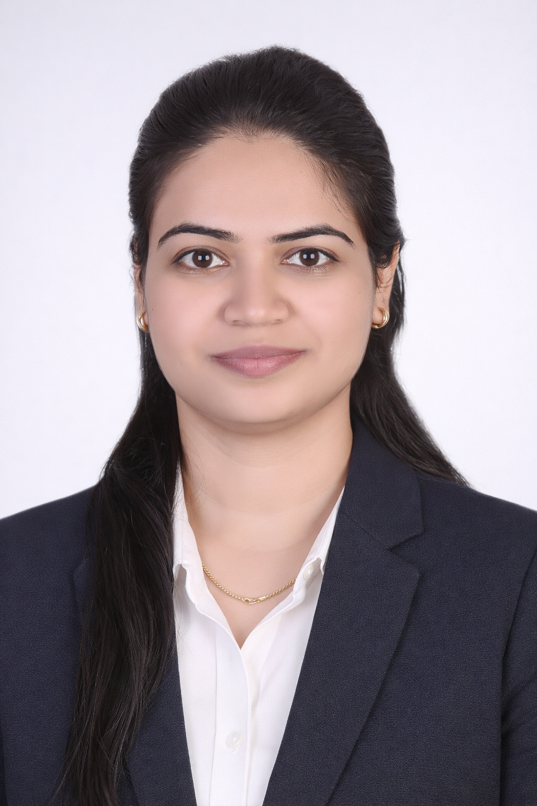

## Azure Cloud & DevOps Engineer

Designing secure, automated Azure infrastructure using Terraform,
CI/CD practices, and cloud governance principles.

Infrastructure-focused engineer with 8+ years managing enterprise
Microsoft cloud environments and transitioning systems toward
Infrastructure as Code and DevOps practices.

---

## What I Build

- Infrastructure as Code using Terraform
- Zero-downtime Azure deployments
- Secure identity architecture
- Multi-environment cloud platforms

---

## Availability

Open to relocation across the European Union and visa sponsorship opportunities.

Available for remote interviews across EU time zones.

[⬇ Download Resume](assets/resume/Pradnya-Deshpande-Resume.pdf){: .btn .btn-primary target="_blank"}
